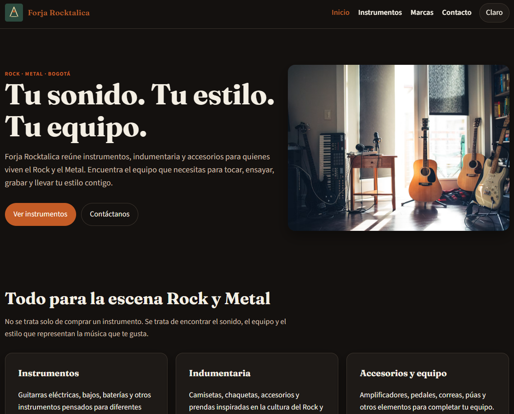
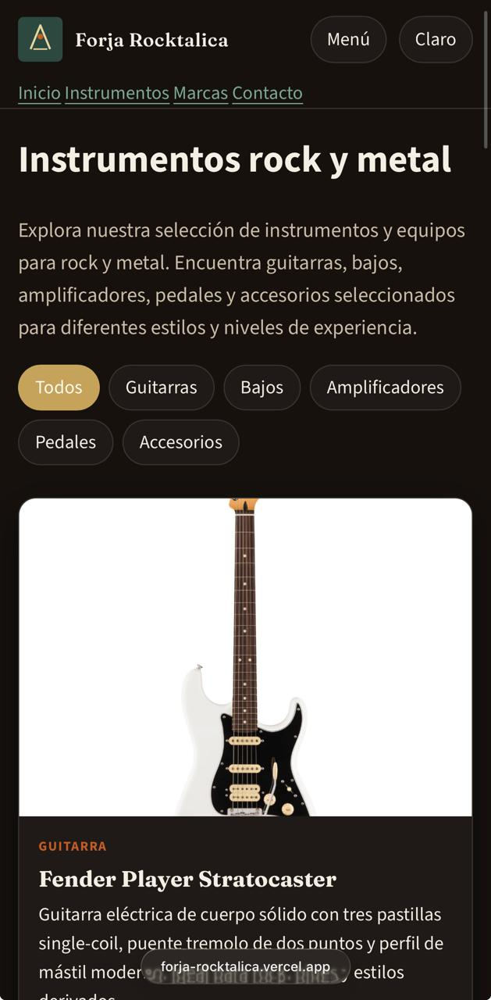

# Forja Rocktalica

Forja Rocktalica es una página web de una tienda de instrumentos y equipos enfocada en rock y metal. La página busca mostrar un catálogo de productos y facilitar que una persona pueda conocer las marcas y hacer una consulta sobre algún instrumento o servicio.

🔗 Sitio en vivo: https://forja-rocktalica.vercel.app/

## Contenido

En la página de inicio se presenta la tienda y se puede acceder a las demás secciones.

En **Instrumentos** se encuentra el catálogo de productos. Hay guitarras, bajos, amplificadores, pedales y accesorios. También se pueden filtrar los productos por categoría.

En **Marcas** se muestran las marcas relacionadas con los productos del catálogo y una pequeña descripción de cada una.

En **Contacto** se encuentran las opciones de clases y servicios, además de un formulario donde el usuario puede escribir sus datos y hacer una solicitud o consulta.

## Capturas

### Escritorio

### Móvil

## Decisiones técnicas

**¿Dónde usaste Flexbox y dónde Grid, y por qué en cada caso?**

Usé **Grid** principalmente para organizar las tarjetas del catálogo, porque necesitaba que los productos se mostraran en varias columnas y que estas se ajustaran dependiendo del tamaño de la pantalla. También se usa Grid en otras partes de la página para organizar contenido en columnas.

Usé **Flexbox** en elementos donde necesitaba alinear componentes en una misma fila o columna, por ejemplo en la barra superior, los botones y algunas partes de las tarjetas. Me sirvió para distribuir los elementos y hacer que se acomodaran mejor en diferentes tamaños de pantalla.

**¿Qué hace tu JavaScript, explicado sin copiar el código? ¿Cómo funciona tu validación?**

El JavaScript se encarga de tomar los productos que están guardados en un arreglo y crear las tarjetas del catálogo automáticamente. Cada tarjeta muestra la imagen, nombre, categoría, descripción, marca y precio. También se puede seleccionar una categoría y el catálogo muestra solamente los productos correspondientes. 

También se usa JavaScript para cambiar entre el modo claro y oscuro y guardar la preferencia del usuario para que no se pierda al recargar la página.

En el formulario se revisa que los campos estén completos y que los datos tengan el formato correcto. Cuando hay un error, se muestra un mensaje debajo del campo correspondiente.

**Si usaste IA, ¿para qué la usaste y qué cambiaste tú del resultado?**

Usé IA principalmente como apoyo para entender algunos errores del proyecto, revisar partes del HTML, CSS y JavaScript y encontrar cosas que no estaban funcionando correctamente.

También me ayudó a organizar algunos cambios de la página y a entender mejor cómo funcionaban algunas partes del código. Yo revisé los cambios, los probé en mi proyecto y tuve que corregir algunas cosas para que funcionaran con la estructura que ya tenía.

**¿Qué fue lo más difícil y cómo lo resolviste?**

Uno de los problemas que tuve fue con las imágenes del catálogo. En el JavaScript estaban escritas las rutas de las imágenes, pero los archivos no estaban dentro de la carpeta `img`, por lo que las imágenes no aparecían en la página.

Lo solucioné revisando las rutas y agregando las imágenes a la carpeta `img` con los mismos nombres que estaban escritos en `datos.js`. También revisé que la extensión de los archivos coincidiera con la ruta.
